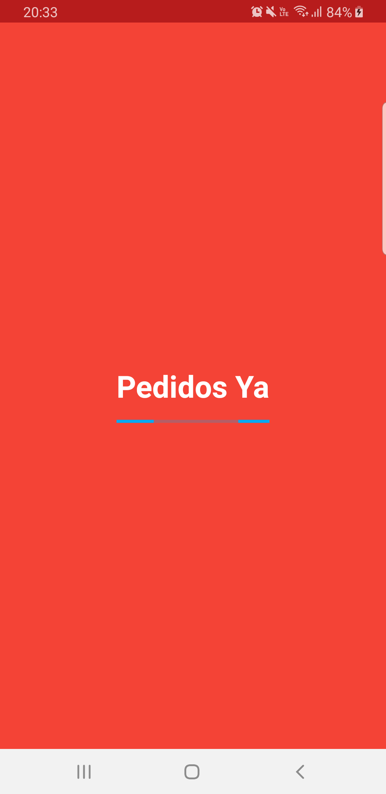
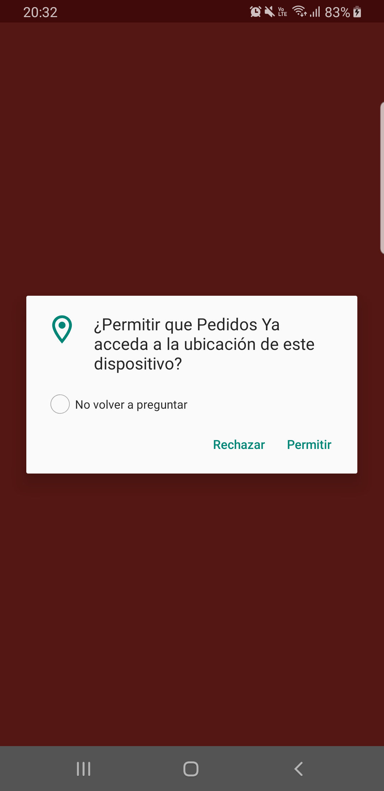
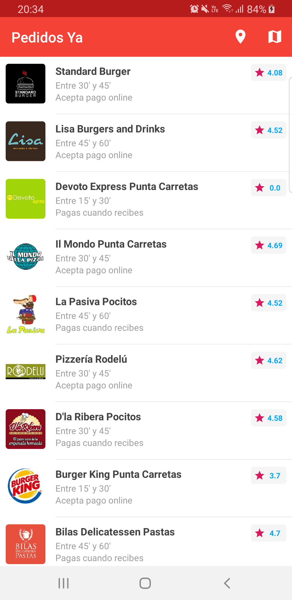
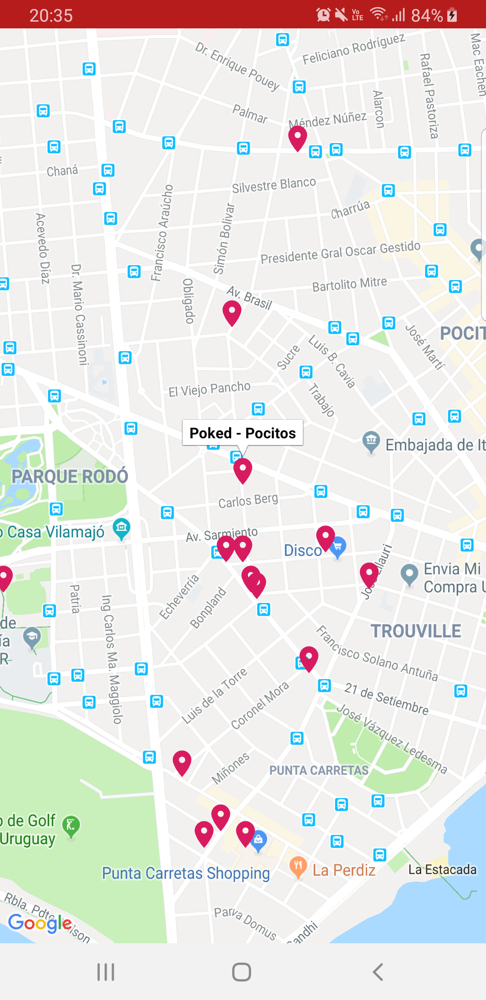
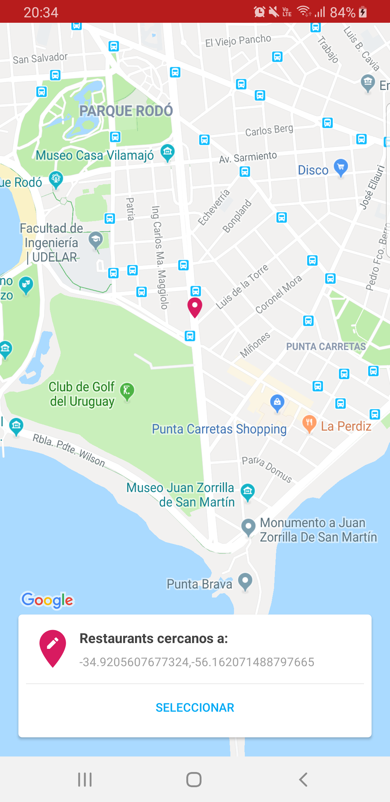

# Pedidos Ya

## Descripcion
Ejercicio tecnico utilizando las API de Pedidos Ya. 
Para correr el proyecto localmente, agregar el archivo `keychain.properties` en el root del proyecto. En dicho archivo debe definir las siguientes constantes:
- client.id -> Para conectarse con la API
- client.secret -> Para conectarse con la API
- google.map.api.key -> Para renderizar el mapa

## Capturas

